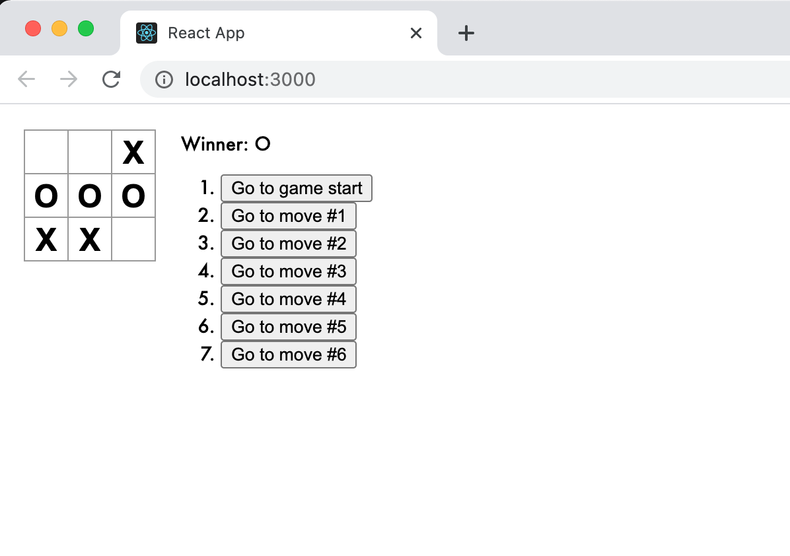

# Nought and Crosses game - built using React

This project was created using React's ['Intro to React' tutorial](https://reactjs.org/tutorial/tutorial.html).

It is a noughts & crosses game, built using React, that:

- Lets you play noughts & crosses,
- Indicates when a player has won the game,
- Stores a game’s history as a game progresses,
- Allows players to review a game’s history and see previous versions of a game’s board.

